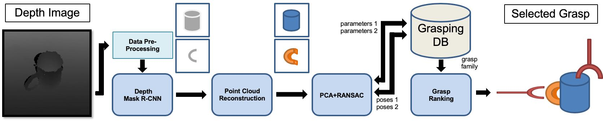

# grasp_primitiveShape

<p align="center">
	
</p>


## Overview
This repository is the implementation code of the paper "Using  Synthetic  Data  and  Deep  Networks to  Recognize  Primitive  Shapes  for  Object  Grasping" ([arXiv](https://arxiv.org/abs/1909.08508), [Project](https://sites.google.com/view/primitive-shape-grasping), [Video](https://www.youtube.com/watch?v=AZuLpEzQMYQ&feature=emb_logo)) by Lin et al. at [IVALab](https://ivalab.gatech.edu/), [Gatech](https://www.gatech.edu/). The algorithm takes a depth image as input and predicts the best grasp of each object in the frame. We employ the [PyTorch-version MaskR-CNN](https://github.com/facebookresearch/maskrcnn-benchmark) network developed by facebook and the rest of the framework is in Python and Matlab. In this repo, we provide our full implementation code of the data generation, data preprocessing and a modified version of the Mask R-CNN model. The ROS code of the real robot grasping experiment is not included. It will be provided in another repository shortly.

## Requirements
- Python 3.5
- PyTorch 1.1.0
- opencv 3.4.2
- numpy 1.15.2
- matplotlib
- tqdm
- scikit-image
- Cuda 9.0

We recommend you to use Anaconda to install the environment.

## Basic Code Structure
- **data_generation**: the implementation of our data generation code
  - **main_New.py**: the main program 
  - **robot_New.py**: the interactive program based on VREP remote API
  - **main_calibration.py**: for camera & background setup
  - **shell_test.sh**:  shell script for starting the data generation process
  - **shell.sh**: shell script for multiprocessing
  - **logger.py**: logging function
  - **utils.py**: utility function from https://github.com/andyzeng/visual-pushing-grasping. Thank you Andy!
- **data_COCOformat**: convert data to COCO fomat for Mask R-CNN
  - **coco_generate.py**: convert data to COCO fomat for Mask R-CNN
  - **compute_mean_ddd_255.py**: compute the mean & std of data 
- **utils**: utils function
  - **coordinates.m**: the primary coordinate conversion code from ROS to VREP simulation environment
  - **preprocess_stretch_noise.py**: simulation data corruption
- **maskrcnn_test**: a modified version of Mask R-CNN code developed by Facebook
  - **demo**: test on Kinect data 
    - **predictor_kinect.py**: visulization function for kinect data
    - **predictor.py**: visulization function for simulation data
    - **preprocess_kinect.py**: the restoration program for the Kinect data
    - **test.py**: the main test program
- **V-REP**: downloaded VREP education program v. 3.6.2 with edited configuration
  
## Usage
### Data generation
Step:
1. Enter **data_generation** folder by running  
```cd data_generation```
2. Run the following command to generate data   
```./shell_test.sh```  
(You can also use **./shell.sh** to generate data in multiprocessing.)   
(You need to rename the output folder's name from e.g. 2020-01-05.17:16:44 to 0 in the logs folder.)
3. Copy the **utils/preprocess_stretch_noise.py** to the same level of the generated dataset folder then run it by   
```python preprocess_stretch_noise.py``` 
(Note that the current preprocessing program deals with the data folders named with 0, 5000, 10000 to 100000, and divide them into 75000/25000 as training dataset and test dataset. You can modify the corresponding python scripts to customize your data.)
1. (Optional) You can also modify the VREP environment according to your case by running  
```./shell_get_environment.sh```.
5. (Optional) You can also modify the design of the primitive shapes by first taking a look at the README.md in **data_generation/objetcs/primitive_shapes/README.md**
   
### Data COCO format
Step: 
1. You should first download and build the library from https://github.com/waspinator/pycococreator.git
2. Create a shortcut of the data folder then copy it to the **data_COCOformat** folder by running  
```ln -s (data folder address) data_COCOformat``` 
3. Enter **data_COCOformat** folder by running  
```cd data_COCOformat```
4. Run the following command to generate the coco style data index  
```python coco_generate.py```
5. Run the following command to calculate the mean \& std of the training data  
```python compute_mean_ddd_255.py```

### How to train/test on the simulation data
Step:
1. Enter **maskrcnn_test** folder by running  
```cd maskrcnn_test```
2. Follow the **INSTALL.md** to install the maskrcnn_benchmark repo
3. Modify the **maskrcnn_benchmark/configs/paths_catalog.py** to add the previous dataset address (Our proposed method use the same dataset address name. So you do not have to bother this step if you follow our data generation process.)
4. Add a **config/XXX.yaml**  for your configuration, including solver, model, etc. Note that **maskrcnn_benchmark/configs/defaults.py** contains more parameters that you can edit.
5. Modify the **train_net.py** and **test_net.py** to add your configuration.
6. Run the following command for training or testing  
```python train_net.py```  
```python test_net.py``` 

### How to test on Kinect data
Step:
1. Copy the test data folder into **demo** folder. The test data folder should follow the following structure:  
**XXX/0/depth_npy_0.npy, XXX/0/color_image_0.npy**
where XXX is the name of the test data folder; 0 refers to the order number of the experiments; depth_npy_0.npy is the point cloud file; color_image_0.png is the RGB ground truth image.
2. Modify the target test data folder in **preprocess_kinect.py** then run it by
```python preprocess_kinect.py```  
(It will generate the processed depth image **depth_img_0.png**.)
1. Modify the target test data folder in **test.py** then run it by   
```python test.py```    
(It will generate the predicted mask label **predict_mask_img_bin_XX_XX.png**, predicted mask area **predict_mask_img_black_white_XX_XX.png** and the visualized result **visualized_image_XX.png**.)
   
## Citations
Please cite grasp_primitiveShape if you use this repository in your publications:

```
@article{lin2019primitiveShapes,
  title={Using Synthetic Data and Deep Networks to Recognize Primitive Shapes for Object Grasping},
  author={Lin, Yunzhi and Tang, Chao and Chu, Fu-Jen and Vela, Patricio A},
  journal={arXiv preprint arXiv:1909.08508},
  year={2019}
}
```

## Licence

Licensed under the [MIT License](LICENSE)
