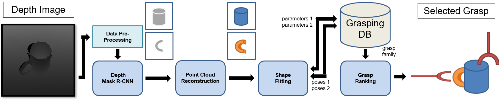

# grasp_primitiveShape

	

## Overview
This repository is the official implementation code of our paper "Primitive Shape Recognition for Object Grasping" ([arXiv](https://arxiv.org/abs/2201.00956) by Lin et al. at [IVALab](https://ivalab.gatech.edu/), [Gatech](https://www.gatech.edu/). 

We will provide the full implementation code of the data generation, data preprocessing, a modified version of the Mask R-CNN model, and a RANSAC-based shape fitting module in this repo.

For more details about our RANSAC-based shape fitting part, please refer to the supplementary material ([PDF](assets/SupplementaryInfo.pdf)).

## Licence

Licensed under the [MIT License](LICENSE)
