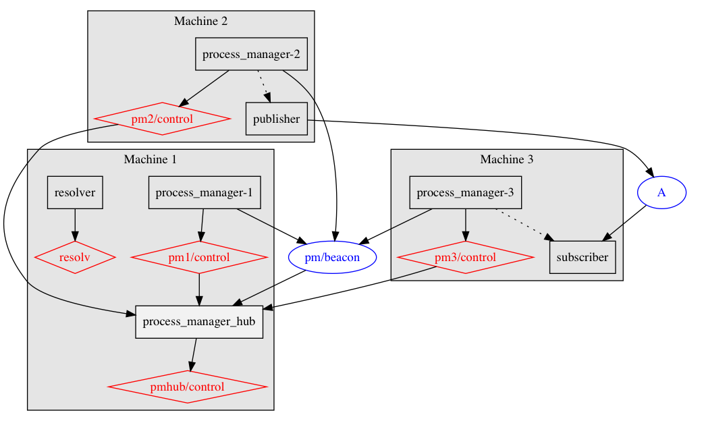

# BlueZero Process Manager

Process Manager is a node meant to manage the starting and stopping of other
subprocesses (typically other nodes).

Ideally, each machine runs a Process Manager node.

Additionally, a Process Manager HUB node is used to simplify the handling of connections
and requests, as shown in the figure below (dotted arrow line indicates a node which spawns
another node as a subprocess):



## Protocol

Following are examples of interacting with the Process Manager node.

The socket receiving requests is a service server at `<node name>/control`, where
`<node name>` is the name of the node of the Process Manager.

All the requests must have content type equal to `b0::process_manager::Request`, as
per built-in parsing of JSON messages.

See also the `scripts` subdirectory for examples of doing this in a shell.

### Starting a process

Request:

```
{
    "start_process": {
        "path": "<full path to program executable>",
        "args": ["<arg1>", "<arg2>", ...]
    }
}
```

Response (if success):

```
{
    "start_process": {
        "pid": <pid>,
        "success": true
    }
}
```

where `<pid>` is the process identifier.

Response (if error):

```
{
    "start_process": {
        "error_message": "permission denied",
        "success": false
    }
}
```

### Stopping a process

Request:

```
{
    "stop_process": {
        "pid": <pid>
    }
}
```

Response (if success):

```
{
    "stop_process": {
        "success": true
    }
}
```

Response (if error):

```
{
    "stop_process": {
        "error_message": "no such pid",
        "success": false
    }
}
```

### Querying a process' status

Request:

```
{
    "query_process_status": {
        "pid": <pid>
    }
}
```

Response (if running):

```
{
    "query_process_status": {
        "running": true,
        "success": true
    }
}
```

Response (if not running):

```
{
    "query_process_status": {
        "exit_code": <exit code>,
        "running": false,
        "success": true
    }
}
```

Response (if error):

```
{
    "query_process_status": {
        "error_message": "no such pid",
        "success": false
    }
}
```

### Listing active processes

Request:

```
{
    "list_active_processes": {
    }
}
```

Response:

```
{
    "list_active_processes": {
        "pids": [<pid1>, <pid2>, ...]
    }
}
```

## HUB

HUB is a node which automatically discovers and connects to all Process Manager nodes in the network.

The protocol is the same, just add also a `host_name` field to the request, e.g.:

```
{
    "host_name": <target host name>,
    "start_process": {
        "path": "<full path to program executable>",
        "args": ["<arg1>", "<arg2>", ...]
    }
}
```

Note: `host_name` must match server's hostname or whatever name has been set with `B0_HOST_ID`.

